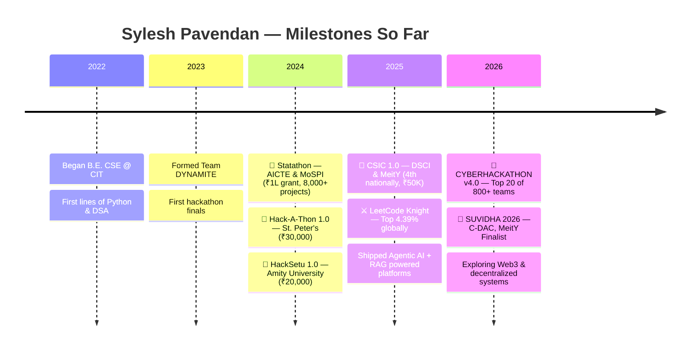
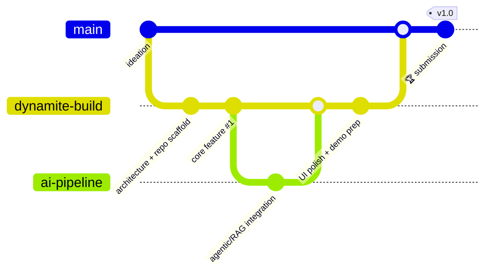

<!-- ============================================================= -->
<!--  SYLESH PAVENDAN · CYBERPUNK GOLD · 3D PORTFOLIO  ·  v6.0    -->
<!--  Theme →  GOLD #F5E36A · BLACK #000000 · BG #0D1117          -->
<!--  Custom 3D SVGs live in /assets — avatar · trophy · projects -->
<!--  Structure → Intro → Who Am I → Tech Grid → Stats → Projects -->
<!--             → Timeline → Achievements → Contact               -->
<!-- ============================================================= -->

<a id="top"></a>

<!-- ░░░░░░░░░░░░░░░░░░  1 · INTRODUCTION  ░░░░░░░░░░░░░░░░░░ -->

<!-- GOLD WAVE RIBBON (decorative only) -->


<div align="center">

<!-- SP SPHERE + FIGURE: inline, no table, no borders -->
<a href="https://www.linkedin.com/in/sylesh-pavendan-361a69328/" title="Connect on LinkedIn"></a>&emsp;&emsp;&emsp;&emsp;&emsp;

<br/><br/>

<!-- CYBERPUNK GLITCH NAME BANNER -->


<br/>

<!-- ANIMATED ROLE TITLES -->


<br/><br/>

<!-- PROFILE VITALS — views · followers · stars · repos -->


<br/><br/>

<!-- BIG ACHIEVEMENT HIGHLIGHTS -->

<br/><br/>

<br/><br/>


</div>

<!-- GOLD DIVIDER -->


<br/>

<!-- ░░░░░░░░░░░░░░░░░░  INTERACTIVE EXPLORE HUB  ░░░░░░░░░░░░░░░░░░ -->
<div align="center">

### 🎮 Explore My Universe — <i>tap to teleport</i>

<a href="#-who-am-i"></a>
<a href="#-tech-stack-grid"></a>
<a href="#-github-stats"></a>
<a href="#-projects"></a>
<a href="#-timeline"></a>
<a href="#-achievements"></a>
<a href="#-contact"></a>

</div>

<br/>

<!-- ░░░░░░░░░░░░░░░░░░  2 · WHO AM I  ░░░░░░░░░░░░░░░░░░ -->
# 🧑‍💻 Who Am I

<div align="center">
<sub>💭 <i>curious · relentless · ships before it's perfect</i></sub>
</div>

<br/>

```python
class SyleshPavendan:
    """Full-stack developer engineering AI-augmented, production-grade systems."""

    role            = "Full-Stack Developer · AI/ML Engineer"
    location        = "📍 Chennai, India"
    education       = "B.E. CSE @ CIT — CGPA 9.1/10"
    languages       = ["Python", "Java", "C++", "TypeScript", "JavaScript", "Dart"]
    frameworks      = ["Flutter", "Next.js", "Node.js", "Firebase"]
    currently_into  = ["Agentic AI", "RAG", "LLM Orchestration", "Web3", "Smart Contracts"]
    competitive     = ["LeetCode Knight — Top 4.39% globally", "1000+ problems solved"]
    team            = "Lead @ Team DYNAMITE — 3× National Hackathon Winner, 25+ Finalist"
    available_for   = ["Full-time roles", "Freelance AI / full-stack builds", "Hackathon squads"]

    def philosophy(self) -> str:
        return "Learn fast → build faster → ship what makes real-world impact."

    def __repr__(self) -> str:
        return f"<{type(self).__name__} based_in={self.location!r}>"


me = SyleshPavendan()
print(me.philosophy())  # → Learn fast → build faster → ship what makes real-world impact.
```

I specialize in engineering scalable, production-grade applications with clean architecture and rapid iteration cycles. My interests span **advanced AI/ML** — Agentic AI, LLMs, RAG, deep learning, and NLP-driven intelligence — and I'm actively exploring **blockchain**, smart contracts, and decentralized systems in the Web3 ecosystem. My ambition is to merge full-stack engineering, AI, and blockchain into high-impact digital products.

<div align="center">


</div>

<br/>

<!-- MOTTO TICKER -->
<p align="center">
<marquee width="80%" direction="left" scrollamount="6">
🔥 Always Learning • Always Building • Always Competing • Full-Stack + AI/ML + Agentic AI + Web3 • Team DYNAMITE • 3x Hackathon Winner • 25+ Finalist • LeetCode Knight • 1000+ Solved 🔥
</marquee>
</p>

<div align="center">
  
</div>


<!-- ░░░░░░░░░░░░░░░░░░  3 · TECH STACK GRID  ░░░░░░░░░░░░░░░░░░ -->
# 🧩 Tech Stack Grid

<div align="center">

<!-- 🪐 CUSTOM 3D ANIMATED ORBIT (hand-crafted SVG) -->

<br/>
<sub>🛰️ <i>A living orbit of my core domains</i></sub>

<br/><br/>

<!-- 🧊 CUSTOM DOMAIN CARDS (hand-crafted animated SVG grid) -->

<br/>
<sub>📦 <i>Full badge grid, category by category, below</i></sub>

</div>

<br/>

| 🧠 Core Languages | 🎨 Frontend & Mobile |
|:---|:---|
|         |        |
| ⚙ **Backend & APIs** | 🗄 **Databases & Cloud** |
|       |        |
| 🤖 **AI / Machine Learning** | 🏗 **System Design & Architecture** |
|          |   -000?style=for-the-badge&logo=redis&logoColor=F5E36A)   |
| ☁️ **Cloud · DevOps & Tools** | 🔐 **Auth, Security & State** |
|        |      |
| 🕸 **Web Scraping & Automation** | 🎥 **Editing & Design** |
|   |     |

<br/>

<details>
<summary><b>🧭 &nbsp;CS Fundamentals & Skill Constellation (expand)</b></summary>

<br/>

**CS Fundamentals** → DSA · OOP · DBMS · Operating Systems · Computer Networks · System Design (HLD/LLD)
**Currently Deepening** → Agentic AI orchestration · Vector DBs (ChromaDB) · DeepAgents · Cassandra · Azure AI Foundry

</details>


<!-- ░░░░░░░░░░░░░░░░░░  4 · GITHUB STATS  ░░░░░░░░░░░░░░░░░░ -->
# 📊 GitHub Stats

<div align="center">
  
  
</div>

<br/>

<div align="center">
  
</div>

<br/>

<!-- 3D-STYLE ISOMETRIC ACTIVITY GRAPH -->
<div align="center">
  
</div>


<!-- ░░░░░░░░░░░░░░░░░░  3D CONTRIBUTION GALLERY  ░░░░░░░░░░░░░░░░░░ -->
<div align="center">

### 🧊 3D Contribution Universe — <i>five styles, one graph</i>

<table>
<tr>
<td align="center" width="33%">

<sub>Git Block</sub>
</td>
<td align="center" width="33%">

<sub>Night Rainbow</sub>
</td>
<td align="center" width="33%">

<sub>Green (Animated)</sub>
</td>
</tr>
<tr>
<td align="center" width="33%">

<sub>Seasons (Animated)</sub>
</td>
<td align="center" width="33%">

<sub>South Seasons (Animated)</sub>
</td>
<td align="center" width="33%">

<sub>Night View</sub>
</td>
</tr>
</table>

<sub>⚙️ <i>Auto-refreshed daily by GitHub Actions (<code>.github/workflows/3d-contrib.yml</code>)</i></sub>

</div>


<!-- ░░░░░░░░░░░░░░░░░░  SNAKE  ░░░░░░░░░░░░░░░░░░ -->
<div align="center">
  
</div>


<!-- ░░░░░░░░░░░░░░░░░░  TROPHIES  ░░░░░░░░░░░░░░░░░░ -->
# 🥇 GitHub Achievements Summary
<div align="center">
  
</div>
<div align="center">
  
  
</div>


<!-- ░░░░░░░░░░░░░░░░░░  5 · PROJECTS  ░░░░░░░░░░░░░░░░░░ -->
# 🚀 Projects

<div align="center">

**🔴 Now Building**

</div>

| Status | Project | Focus |
|:---:|:---|:---|
| 🟢 | **Cryptographic AI Forensic Platform** | Explainable anomaly detection · GDPR-safe |
| 🟢 | **Patient–Doctor Management Portal** | Agentic scheduling · GenAI routing |
| 🟡 | **EDUMITE — Adaptive Learning AI** | LLM + NLP driven tutoring |
| 🟡 | **ASI-Gen — Agentic Report Engine** | RAG + multi-agent statistical pipelines |

<div align="center">


</div>

<br/>

<div align="center">

<!-- 🧊 CUSTOM 3D PROJECT CARDS (hand-crafted animated SVG) — click to explore -->
<a href="https://github.com/SYLESH-1125?tab=repositories" title="Explore all repositories"></a>

<br/>
<sub>👆 <i>Tap a card above to dive into the code — or read the full case study below</i></sub>

</div>

<br/>

**📖 Case studies — Problem · Approach · Stack · Outcome**

| 🔐 Cryptographic AI Forensic Platform | 🏥 Patient–Doctor Management Portal |
|:---|:---|
| **Problem.** Security teams need automated forensic intelligence, but most tooling is slow, opaque, and non-compliant with privacy law. **Approach.** Built a pipeline that ingests data via JIT tokens, stores it in Parquet/DuckDB for rapid querying, and flags anomalies with an explainable Drain3 + Isolation Forest + SHAP stack. **Stack.** `Python` · `DuckDB` · `SHAP` · `Cryptography` · `Anomaly Detection` **Outcome.** Explainable threat detection with GDPR-compliant cryptographic data shredding built in by design. | **Problem.** Clinics run appointments, cancellations, and patient routing across disconnected manual workflows. **Approach.** Shipped a full-stack portal with agentic workflow automation for scheduling and GenAI-driven routing logic across role-aware dashboards. **Stack.** `Next.js` · `Node.js` · `GenAI` · `Firebase` · `Agentic AI` **Outcome.** One system serving patients, doctors, admins, and receptionists with real-time flow. |
| 🎓 EDUMITE — Adaptive Learning AI | 📊 ASI-Gen — Agentic Report Engine |
| **Problem.** Learners get generic content instead of a path tuned to their actual weak spots. **Approach.** Combined LLM + NLP intent detection on quiz/interaction data with behavioral analytics to drive a probabilistic recommendation engine. **Stack.** `LLMs` · `NLP` · `Python` · `React` · `Recommendation Systems` **Outcome.** An adaptive engine that reshapes the study path per learner, in real time. | **Problem.** Government-scale survey pipelines are manual, slow, and error-prone at scale. **Approach.** Orchestrated a RAG + multi-agent LLM pipeline to automate survey processing end-to-end, with strict statistical validation gates. **Stack.** `RAG` · `Multi-Agent` · `BERT` · `Python` · `LLM Orchestration` **Outcome.** Automated, deviation-free generation of comprehensive statistical reports via Z-score/IQR + BERT validation. |

<div align="center">

<a href="https://github.com/SYLESH-1125?tab=repositories"></a>

</div>


<!-- ░░░░░░░░░░░░░░░░░░  6 · TIMELINE  ░░░░░░░░░░░░░░░░░░ -->
# 📅 Timeline

<div align="center">

<!-- 🧊 CUSTOM YEARLY HIGHLIGHTS (hand-crafted animated SVG) -->


</div>

<br/>



<br/>

**⚡ Sprint Flow — how a hackathon week runs for Team DYNAMITE**




<!-- ░░░░░░░░░░░░░░░░░░  7 · ACHIEVEMENTS  ░░░░░░░░░░░░░░░░░░ -->
# 🏆 Achievements

<table width="100%">
<tr>
<td width="34%" align="center" valign="middle">

<!-- 🏆 CUSTOM 3D ANIMATED TROPHY (hand-crafted SVG) -->


<br/>


</td>
<td width="66%" valign="middle">

| 🏅 | Event · Authority | Highlight |
| :--- | :--- | :--- |
| 🥈 | **Statathon** · AICTE & MoSPI *(Govt of India)* | **₹1 Lakh** grant · among **8,000+** projects |
| 🏅 | **CSIC 1.0** · DSCI & MeitY *(Govt of India)* | **4th nationally** · **₹50K** · **5,000+** projects |
| 🥈 | **Hack-A-Thon 1.0** · St. Peter's (HYD) | **₹30,000** · among **2,000+** entries |
| 🥈 | **HackSetu 1.0** · Amity University (MP) | **₹20,000** · top of **1,000+** global entries |
| 🎯 | **CYBERHACKATHON v4.0** · Chennai Police | Finalist · **Top 20** of **800+** teams |
| 🎯 | **SUVIDHA 2026** · C-DAC, MeitY *(Govt of India)* | Finalist · **Top 50** · Best Innovation |
| ♞ | **LeetCode Knight** | Top **2%** globally · **1000+** solved |

</td>
</tr>
</table>

<br/>

**🧩 Competitive Programming**

<p align="center">
  <a href="https://leetcode.com/u/SYLESH_/">
    
  </a>
</p>

<p align="center">
  
</p>

<div align="center">


</div>


<!-- ░░░░░░░░░░░░░░░░░░  8 · CONTACT  ░░░░░░░░░░░░░░░░░░ -->
# 📬 Contact

<p align="center">
<a href="https://discord.com/invite/YzzuBVk9"></a>
<a href="https://instagram.com/syl._.star"></a>
<a href="https://www.linkedin.com/in/sylesh-pavendan-361a69328/"></a>
<a href="mailto:sylesh1125@gmail.com"></a>
</p>

<div align="center">

[](https://visitcount.itsvg.in)

<sub>⭐ <i>Engineered with gold-standard precision by <b>Sylesh Pavendan</b></i></sub>

</div>

<!-- GOLD 3D WAVE FOOTER -->


<div align="center">
<a href="#top"></a>
</div>
